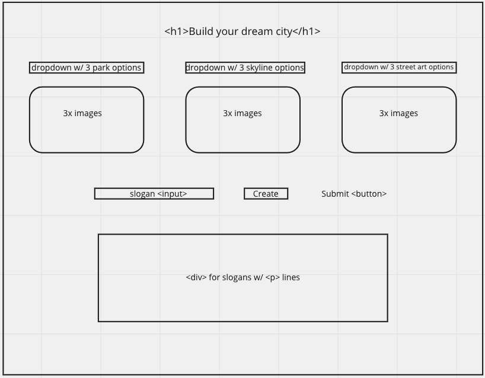

## The Golden Rule:

🦸 🦸‍♂️ `Stop starting and start finishing.` 🏁

If you work on more than one feature at a time, you are guaranteed to multiply your bugs and your anxiety.

## Making a plan

<!-- 1. **Make a drawing of your app. Simple "wireframes"** -->
1. **Look at the drawing and name the HTML elements you'll need to realize your vision**
    - 3 dropdowns w/ selectEl.value
    -slogan input field 
    - submit button
    -3 divs for photos
    -div for slogans w/ p within
1. **Look at the drawing and imagine using the app. What _state_ do you need to track?**
    - tracking which dropdown is being chosen/what photo shows
    - tracking what has been entered in the slogan input
    - tracking number of clicks
1. **For each HTML element ask: Why do I need this? (i.e., "we need div to display the results in")**
    - 3 dropdowns w/ selectEl.value
        - let user select different options
    -slogan input field 
        - let user put in a slogan and to track entries
    - submit button
        - submit what has been typed in the input
    -3 divs for photos
        - a space to house photos to give user visual representation of choices
    -div for slogans w/ p within
        - so words can be entered in/compile list of slogans
1. **Once we know _why_ we need each element, think about how to implement the "Why" as a "How" (i.e., `resultsEl.textContent = newResults`)**

1. **Find all the 'events' (user clicks, form submit, on load etc) in your app. Ask one by one, "What happens when" for each of these events. Does any state change? Does any DOM update?**

1. **Think about how to validate each of your features according to a Definition of Done. (Hint: console.log usually helps here.)**

1. **Consider what features _depend_ on what other features. Use this dependency logic to figure out what order to complete tasks.**

Additional considerations:

-   Ask: which of your HTML elements need to be hard coded, and which need to be dynamically generated?
-   Consider your data model.
    -   What kinds of objects (i.e., Dogs, Friends, Todos, etc) will you need?
    -   What are the key/value pairs?
    -   What arrays might you need?
    -   What needs to live in a persistence layer?
-   Is there some state we need to initialize?
-   Ask: should any of this work be abstracted into functions? (i.e., is the work complicated? can it be reused?)
